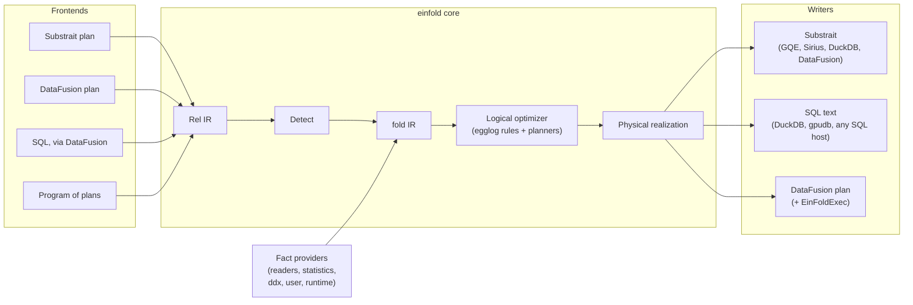
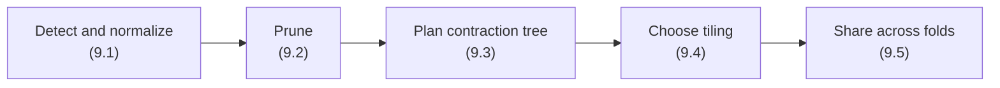

<!--
SPDX-FileCopyrightText: 2026 Alexander Merose <al@merose.com> & einfold Authors

SPDX-License-Identifier: Apache-2.0
-->

# einfold: Fast Folds over Joins, for Tensors and the XQL Model

Status: draft v15. Author: Alex Merose. Last updated: 2026-10-08. Repository: [xqlsystems/einfold](https://github.com/xqlsystems/einfold). License: Apache-2.0.

This doc gives the design and the reasons for it. Its companion, the [supplement](supplement.md), holds the details: algorithms, rule tables, correctness arguments, and the evidence from spikes. The supplement's sections are numbered to match this doc's.

## 1. Summary

einfold makes tensor computation, and more generally aggregation over joins, fast inside SQL engines, on any hardware those engines run on. Its name joins *einsum*, the standard notation for tensor contractions, with *fold*, functional programming's word for a reducing pass. That is the system's core idea: evaluate an aggregate over a join by folding each joined row into its group as the join produces it, so the join's rows never pile up.

**The setting.** XQL Systems builds SQL access to large scientific arrays, such as climate and weather data. In the XQL model, a dataset becomes a table with one row per combination of coordinates (for example one row per time, latitude, and longitude), and each variable (such as temperature) becomes a column. Much array math then becomes joins and aggregations. In particular, a **tensor contraction** (matrix multiplication is the simplest case) becomes a join followed by a `SUM` over groups. That shape, a join followed by any aggregate, is what einfold calls a **fold over a join** (section 2.2).

**The problem.** SQL engines run contractions badly. They materialize huge intermediate joins, sum too late, and ignore the dense structure of the arrays (section 3).

**The approach.** einfold **rewrites query plans; it never executes them.** A query plan is the tree of relational operators (scans, joins, aggregates) that an engine builds from a SQL query. einfold takes a plan in, finds the folds over joins inside it, and returns a plan that the engine runs faster. The engine, which this doc calls the **host**, may run on CPU or GPU. einfold never touches a device. Every part of einfold (plan readers and writers, fact providers, planners, the reference executor) is a separate, swappable piece behind a small interface.

**Key decisions.**

1. **Folds, not just sums.** The central object is the fold over a join: any aggregate whose partial results merge, such as `SUM`, `COUNT` or `AVG`. Einsums are the most important case. Every fold gets the fused join-and-aggregate operator; *semiring* folds, such as einsums, also get the algebraic rewrites (section 2.2, [RFC 0001](rfcs/0001-folds-over-joins.md)).
2. **Two output forms.** A *relational form* of standard joins and aggregates that any host runs, and an *extension form*, a `Fold` Substrait relation that hosts can adopt for full speed (section 7.2).
3. **A hybrid optimizer.** Algebraic rewrites run on egglog, an engine that explores many equivalent versions of a plan at once. Contraction order comes from a specialized planner called during egglog's extraction, and tilings are proposed by a planner and chosen in the e-graph (section 7.6).
4. **Facts in a side channel.** What einfold knows about each operand (dimensions, extents, layouts, statistics) travels in its own fact table, filled by one provider per reader, not in Arrow or Substrait metadata (section 8.1).
5. **Exact where SQL is exact; deterministic where einfold runs.** einfold never adds nondeterminism, and keeps exactly computed values exact. Float results are equivalent within a stated error bound. Bit-for-bit repeatable float sums are a setting on hosts, and the default in einfold's own executor, where splitting work into fixed blocks chosen from the shape makes them free (section 8.6).
6. **Users declare, einfold proves.** Anything that changes results (filters, masks, approximations) is written in plain SQL. einfold infers only optimizations it can prove exact, such as skipping exact zeros (section 9.2).
7. **Tiling is part of the algebra.** Following Cubed, a tiled computation is a block-level einsum or a change of tiling, and plans over a memory budget are rejected at planning time (section 9.4).
8. **Programs, not just queries.** einfold optimizes one plan at a time, or a whole program of plans that read each other's results, such as a training step (section 7.3).

**Origin.** einfold grew out of [ddx](https://github.com/xqlsystems/ddx), an XQL Systems project for automatic differentiation of SQL queries. Given a query that computes a function (for example a small neural network written as joins and aggregates), ddx produces the queries that compute its gradients. Training a model this way is mostly contractions, and their slowness motivated einfold. ddx benefits from einfold but does not depend on it.

**Status.** Twenty-two of twenty-five design spikes are done (section 13). Their outcomes are folded into this doc; their reports are in [`docs/spikes/`](spikes/README.md). einfold has not yet shown a speedup inside a host. The first implementation of M1, a hash-based EinFold, ran at 0.11–0.6× of plain DataFusion on ddx's workloads ([`docs/lessons.md`](lessons.md)). Spike S21 then measured the room there is: hand-written dense, positional kernels beat DataFusion and DuckDB by 4–14× on ddx's matrix products and 13–48× on its attention. v14 ordered the roadmap by value, dense kernels first, and gated every milestone on beating the host on its benchmark (section 16). v15 follows a design review (issue #30) and spikes S22–S25. ddx's gradient steps are not the two-table products S21 timed, and a detector for those would match only 13–32% of their time. But a fold node that ddx emits directly, run by a dense kernel that also writes ddx's "fill" rows, runs `matmul`'s gradient steps 33–57× faster (section 3). So M1 is now an explicit fold that a plan producer emits, and detection moves to M2. The machinery that later milestones need (the egglog optimizer, tiling and GPU hosts) is designed here, but deferred until the earlier milestones have paid off.

## 2. Background

### 2.1 The XQL ecosystem

The data lives in **Zarr**, a storage format for large N-dimensional arrays. Zarr splits each array into fixed-size **chunks**, stores each chunk as a separate compressed object, on disk or in cloud object storage, and records the array's shape, chunk shape, data type and dimension names as JSON metadata. **Xarray** is a Python library for labeled arrays: arrays with named dimensions and coordinate values along each dimension. Most climate and weather datasets in Zarr are written and read through Xarray.

[XQL Systems](https://xql.systems) builds SQL on top of Zarr. einfold must work with these **readers**, the projects that turn arrays into tables:

| Reader | Engine | Notes |
|---|---|---|
| [xarray-sql](https://github.com/alxmrs/xarray-sql) (XQL Systems) | DataFusion; also DuckDB, Polars, and databases reached through ADBC or Flight SQL | One Arrow record batch per chunk, one table per group of variables that share dimensions. Reports row counts and dimension ranges, so DataFusion skips partitions |
| [duckdb-zarr](https://github.com/xqlsystems/duckdb-zarr) (XQL Systems) | DuckDB | The `zarr` community extension. One table per group of variables that share dimensions; reads only the columns a query needs |
| [zarr-datafusion](https://github.com/stratoscale-io/zarr-datafusion) | DataFusion | Dictionary-encodes coordinates, pushes filters into its scan, and computes simple aggregates over its scan itself |
| [Zax-SQL](https://docs.earthmover.io/compute/sql) | DataFusion, hosted by Earthmover | Reads Icechunk, Earthmover's versioned storage for Zarr. Flattens like Xarray's `Dataset.to_dataframe()`, and turns filters on dimensions into slices |

All of them flatten a chunked array into rows, and einfold needs the structure they flatten away. Spike S1 found that they also disagree on much of what einfold needs to know, such as whether missing data arrives as NULL or NaN (supplement section 2.1).

### 2.2 Einsums, and folds over joins

An **einsum** names each axis of each input with a letter, and names the axes of the output. Any letter that does not appear in the output is summed over. Matrix multiplication `C[n,h] = Σ_d X[n,d]·W[d,h]` is written `nd,dh->nh`. A **tensor contraction** is any einsum that sums over at least one shared axis. (From section 6 on, this doc calls axes *dimensions*.)

In the XQL model, `X` and `W` are tables of `(axis…, value)` rows, and the matrix product is:

```sql
SELECT x.n, w.h, SUM(x.v * w.v) AS v
FROM X x JOIN W w ON x.d = w.d
GROUP BY x.n, w.h;
```

Contracted axes become join keys; output axes become group keys. Blacher et al. (2023), who studied how to evaluate einsums portably in SQL databases, show that four rules turn any einsum into one SQL query of this shape:

1. list the inputs in `FROM`;
2. list the output axes in `SELECT` and `GROUP BY`;
3. take the `SUM` of the product of the values;
4. equate shared axes in `WHERE`, transitively.

**Folds over joins.** Replace `SUM` with any aggregate, and the product with any expression of the joined row, and the query is still slow for the same reason: the join's rows are materialized before they are aggregated. einfold calls this general shape a **fold over a join**, and recognizes three levels of structure in it ([RFC 0001](rfcs/0001-folds-over-joins.md)):

1. **A fold.** The aggregate's partial results can be merged, associatively and commutatively: `SUM`, `COUNT`, `MIN`, `MAX`, `AVG`, `BOOL_OR`. In algebra, the partial state is a *commutative monoid*. Every fold can be computed by fusing the join with the aggregate, so join rows never exist (section 10.2).
2. **A semiring fold.** The row value is a product, under some ⊗, of one factor per input, and the aggregate is a ⊕ that ⊗ distributes over: `a ⊗ (b ⊕ c) = (a ⊗ b) ⊕ (a ⊗ c)`. Einsums (`SUM` of `*`) are the main example. `COUNT` of a join, `MIN` of sums (shortest paths) and `MAX` of products are others. Distributivity is what makes it correct to aggregate an input before joining it, and to reorder the joins: the algebraic rewrites of sections 9 and 10.1.
3. **An algebraic fold.** `AVG(a.v * b.v)` is `SUM(a.v * b.v) / COUNT(a.v * b.v)`, two semiring folds over one join followed by a final division, so it gets everything level 2 gets.

The levels follow the classes of aggregates in Gray et al.'s data-cube paper ("Data Cube: A Relational Aggregation Operator", 1997), which sorts aggregates by the state a partial result must carry. A *distributive* aggregate (`SUM`, `COUNT`, `MIN`, `MAX`, `BOOL_AND`) folds each value, perhaps lifted first (`COUNT` lifts it to 1), with one operation. An *algebraic* aggregate (`AVG`, and in principle variance, covariance and regression) is a fixed tuple of distributive ones plus a final function. Three classes are not folds einfold handles yet: *holistic* aggregates (`MEDIAN`, `COUNT(DISTINCT)`), whose state grows with the input; *approximate* ones (`approx_distinct`), whose state is a mergeable sketch; and *order-dependent* ones (`STRING_AGG`, `FIRST_VALUE`), which are out of scope.

This doc teaches with einsums, the most familiar case, and says where the general fold differs.

### 2.3 Hosts

einfold's output must run on engines we do not control. Hosts take plans as **SQL text**, or as **Substrait**, a cross-engine standard for serialized query plans.

| Host | Hardware | Reads | Notes |
|---|---|---|---|
| Apache DataFusion | CPU | its own plans, SQL, Substrait | Rust, built on Arrow, designed to be extended with optimizer rules and operators. xarray-sql, zarr-datafusion and Zax-SQL use it |
| NVIDIA GPU Query Engine (GQE) | GPU | Substrait, SQL | Built on libcudf, NVIDIA's GPU DataFrame library; plans with DataFusion |
| DuckDB | CPU | SQL, Substrait | An in-process analytical database |
| DuckDB + [gpudb](https://github.com/singhpratech/duckdbgpumetaldbram) | GPU (CUDA, Metal) | SQL | Rewrites SQL statements before DuckDB plans them. Never moves float `SUM` to the GPU, and matches only base-table joins that don't expand much, so few einsums qualify today (spike S5) |
| DuckDB + [Sirius](https://github.com/sirius-db/sirius) | GPU (CUDA) | DuckDB plans, via Substrait | Intercepts DuckDB's plans and runs supported operators on GPU, falling back to the CPU |

So einfold must write both **Substrait and SQL**. Details on each host are in the supplement (section 2.3).

## 3. Problem

Building ddx exposed three inefficiencies in how SQL engines run contractions:

1. **Join rows pile up.** In the matrix product above, with `X` of size `N×D` and `W` of size `D×H`, the join emits `N·D·H` rows before `SUM` collapses them. A dense matrix-multiply routine (GEMM, the standard routine in the BLAS linear-algebra libraries) does the same arithmetic without storing any intermediate.
2. **No aggregation pushdown.** Engines do not move a `SUM` below a join. For a product of three or more inputs, the full join is built before anything is summed. The order of contractions that keeps intermediates small is invisible to a join optimizer.
3. **Lost dense structure.** A table does not say that its coordinates map arithmetically to memory offsets, so the engine cannot choose a dense kernel even when the data is dense.

**Baseline.** ddx's `matmul` benchmark on DataFusion multiplies a 50,000×16 matrix by a 16×8 matrix and differentiates `SUM(tanh(X·W)²)`. The forward query takes 144 ms. The gradient program takes 1.40 s, almost all of it executing (building the program takes 1.4 ms), though it needs only two more contractions: for `Y = X·W`, the gradients are `X̄ = Ȳ·Wᵀ` and `W̄ = Xᵀ·Ȳ`, where a bar marks the gradient of the final result with respect to that matrix. Those two steps take 597 and 516 ms, while the same contractions written as plain two-table queries take 52 and 28 ms (spike S21). Spike S22 found why:

- **Each gradient step rebuilds the forward join** (`N·D·H` = 6.4 M rows), only to test whether the forward product was NULL. It then joins those rows to the cotangent, aggregates, and left-joins back to the input table, so every input row gets a gradient (0 where none reached it).
- **The NULL test is redundant**: on random tables with NULLs, NaNs, missing rows and duplicate keys, a two-table contraction followed by the same left join gives the same gradient. As SQL that is 3.7× faster; a dense kernel that writes every position, so needs no left join, is 68× faster (S22, S25).

So problem 1 bites twice: once in the join itself, and again because producers like ddx write folds in shapes that hide the contraction. A fold that ddx emits explicitly avoids both (section 7.3).

Three more problems come from the XQL setting:

4. **Chunk misalignment.** Zarr arrays are chunked, and the chunks of two inputs rarely line up on a shared dimension.
5. **Repeated values.** Flattening repeats every lower-dimensional variable across the dimensions it lacks, and every row pays for the repetition (section 9.1).
6. **Planning cost.** Large einsums produce large queries, and host optimizers can spend more time planning them than running them (section 9.3).

## 4. Principles

1. **einfold rewrites, hosts execute.** einfold's product is a better plan. Hardware is the host's job.
2. **The XQL logical model is the contract.** A dataset is a table with one row per coordinate tuple, its dimensions as key columns and its variables as value columns. einfold never changes what a query means or the shape of its result. Layouts, tiles, and partial states are physical, and they live inside operators.
3. **Every rewrite has a portable fallback.** If a host cannot run a richer form, einfold still gives it a plan made of standard relational operators.
4. **Never wrong.** A rewrite is applied only when it is proven equivalent under SQL semantics, including NULLs and bag semantics (SQL tables may hold duplicate rows, and aggregates count every duplicate). Values computed exactly (integers, `DECIMAL`, `COUNT`, `MIN`, `MAX`) stay exact. Float results stay within the error bound that any order of the same additions has (section 8.6). Missing a speedup is acceptable; changing a result is not.
5. **Never add nondeterminism.** einfold never makes a plan less repeatable than the plan it received. Bit-for-bit determinism is a setting users can request, and the default wherever einfold itself executes (section 8.6).
6. **A chunk is a partition.** Storage tiles are the natural unit of reading, pruning, parallelism, and partial aggregation (section 8.2).
7. **Composable by default.** Readers, writers, fact providers, and planners are plugins behind narrow interfaces. Nothing in the core knows which engine or device is downstream.
8. **Users declare semantics; einfold proves optimizations.** Anything that changes results (a filter on values, a mask, a top-k selection, an approximation such as sampling) is written by the user in SQL, and einfold keeps its meaning. Assertions that do not change results (constraints, statistics, layout metadata) are facts that einfold may exploit. einfold infers an optimization on its own only when it can prove it exact (section 9.2).

## 5. Goals and non-goals

### Goals

- Read relational plans (Substrait, DataFusion's `LogicalPlan`) and write optimized plans (Substrait, SQL for named dialects).
- Remove the aggregation-pushdown and contraction-order problems on every host, using standard operators only.
- Define an `Fold` Substrait extension relation that carries contraction structure and facts, for hosts that implement it.
- Carry facts (dimensions, extents, layouts, tilings, statistics) from readers to the plan, Zarr first.
- Ship a reference executor for DataFusion that proves the extension is worth adopting.
- Integrate with xarray-sql, duckdb-zarr, zarr-datafusion, Zax-SQL, and ddx.

### Non-goals

- GPU or other device kernels. Hosts provide them.
- Automatic differentiation. That stays in ddx.
- Distributed execution. Plans should not prevent it.
- Changing query semantics to match Xarray (for example Xarray's `skipna`, which ignores NaN in sums). einfold preserves the SQL meaning of the plan it is given (section 6.2).

## 6. Vocabulary

einfold sits where three vocabularies meet: XQL and Xarray, einsum notation, and relational algebra. These are the terms the rest of the doc relies on, by layer; the supplement (section 6.1) has the full glossary.

**Data** (the XQL model):

| Term | Meaning |
|---|---|
| **Coordinate**, **position** | A label along an axis (`30.0°N`), and an integer offset `0 … n−1` along it. Coordinates are what tables hold; positions are what dense kernels need |
| **Extent** | The number of positions along an axis |
| **Support** | The coordinate tuples that have a row |
| **Fill value** | Zarr's value for chunks that were never written |
| **Tile**, **chunk** | A rectangular box of positions; a chunk is a storage tile in Zarr |
| **Layout** | How positions within a tile map to row order |

**Queries:**

| Term | Meaning |
|---|---|
| **Fold** (over a join) | A join of operands, grouped by output dimensions, with an aggregate folding each group's row values (section 2.2) |
| **Operand** | One input to a fold: a table, a subquery, or a mask. Often one data variable over its own axes |
| **Dimension** | One variable of a fold: a set of columns the query equates, with how it compares them (`=` or `IS NOT DISTINCT FROM`). A data axis becomes a dimension when a query joins or groups on it. This doc says "dimension" where einsum literature says "index" |
| **Aggregate** | How a group's values combine (`SUM`, `COUNT`, `AVG`, …), with SQL's rules for NULLs, empty groups and exactness. *Distributive* (one operation) or *algebraic* (distributive parts plus a final function), as section 2.2 explains |
| **Row value**, **factor** | What each joined row contributes. When it is a product, each operand contributes one **factor**: an expression over that operand's columns alone |
| **Semiring fold** | A fold whose row value is a ⊗-product of factors, and whose aggregate is a ⊕ that ⊗ distributes over. A property derived from the fold, which unlocks the algebraic rewrites |
| **Einsum** | The sum-product semiring fold: `SUM` of products |
| **Mask** | An operand that only filters which rows join, contributing no value: its factor is ⊗'s identity (section 9.1) |
| **Fact** | Something known about an operand or a dimension, tagged with how it is known (section 8.1) |

**Evaluation and execution:**

| Term | Meaning |
|---|---|
| **Partial aggregate** | A group's state over part of the input, mergeable with other parts: whether any row reached the group, plus the aggregate's own state (section 8.3) |
| **Accumulator** | How an aggregate state's additions are computed numerically, such as plain `f64` or a binned reproducible sum (section 8.6) |
| **Contraction**, **contraction tree** | One step of a semiring fold: join two operands, and aggregate away the dimensions nothing else needs. A tree of them evaluates the fold |
| **EinFold** | einfold's fused join-and-fold operator, for any fold (section 10.2). The capitalized name is the operator; lowercase **einfold** is the package |
| **Relational form**, **extension form** | einfold's two output forms: standard joins and aggregates, or a `Fold` Substrait relation (section 7.2) |
| **Target profile** | Data describing what a host supports (section 7.4) |
| **E-graph**, **extraction** | A structure holding many equivalent versions of an expression, and choosing the cheapest one (section 7.6) |

Notation: `dims(T)` is the set of dimensions of operand `T`, and `O` the output dimensions. A dimension in two or more operands is **shared**; one not in `O` is **aggregated away** (for einsums, *summed*); one in exactly one operand and not in `O` is **private**. A query can name one output dimension in several output columns (`GROUP BY a.k, b.k` where `a.k = b.k`), so output dimensions and output columns are kept distinct.

**Nuances of the data model.** Every rewrite respects these; the supplement (section 6.2) explains each.

- Coordinates are not positions, and the map between them is a fact that must be exact.
- Joins compare coordinates exactly, and the fill value decides what a missing chunk means.
- SQL semantics govern, not Xarray's: SQL `SUM` skips NULL but propagates NaN.
- A group exists only where some row joined, whatever the aggregate. Its `SUM` or `AVG` is NULL only if every contribution was NULL, and its `COUNT` is then 0.
- SQL sums duplicates (bag semantics).
- Memory order, sharding and irregular chunk grids are all metadata a reader must report.

## 7. Architecture

### 7.1 Overview



- **Rel IR.** einfold's representation of relational plans, kept close to Substrait.
- **Fold IR.** einfold's representation of a fold over a join: operands, dimensions (each with its key equality), output dimensions, the row value and the aggregate, with facts attached. Whether the fold is a semiring fold is derived from these, not stored.
- **Logical optimizer** (section 9). Detection, pruning, contraction order, tiling, and sharing work across folds.
- **Physical realization** (section 10). Turns each node of the contraction tree into something a host can run.

### 7.2 Output forms

einfold produces two output forms, and picks one per subplan from the host's target profile.

- **The relational form** is standard Substrait or SQL. For a semiring fold, each node of the contraction tree becomes a join followed by an aggregate, so dimensions are aggregated away as early as possible (section 10.1). It fixes problem 2 on every host. It cannot speed up a two-operand fold such as a matrix product, which has nothing to aggregate early, nor a fold that isn't a semiring fold.
- **The extension form** is a `Fold` Substrait extension relation that carries a fold and its facts. A host that implements it can run EinFold (section 10.2), which fuses the join with the aggregate for any fold, with dense and block-sparse kernels where the semiring has them, at GEMM-class speed for einsums. It is the only fix for problem 1. It is published as a spec with a conformance suite, so hosts can adopt it without depending on einfold's code.

einfold ships one reference executor: `EinFoldExec`, a DataFusion operator that implements the extension form. It proves the extension is worth adopting, and ddx uses it directly. Device executors belong to the hosts.

### 7.3 Deployment modes

- **In-engine rule.** In DataFusion, einfold runs as an optimizer rule. xarray-sql, zarr-datafusion and ddx enable it with one call.
- **Plan-to-plan.** Given a Substrait plan and a target profile, return a Substrait plan. This is how GQE is fed.
- **SQL-to-SQL.** Given SQL, a dialect and a target profile, return SQL. This is how DuckDB, gpudb and Sirius are fed, and how a client can use einfold with Zax-SQL today. einfold parses the SQL into DataFusion's *unoptimized* plan, applies only its own rewrites, and writes SQL back with DataFusion's `Unparser`; the target engine optimizes the result itself. Spike S7 found this the only safe order: unparsing DataFusion's *optimized* plans produced SQL that DuckDB rejected, and once, SQL that silently returned a wrong answer (supplement section 7.3).
- **Explicit fold.** A plan producer that knows it is writing a fold, such as ddx writing a gradient step, emits a `Fold` node directly: its operands, dimensions, aggregate and fill table (section 8.3). einfold then needs no detection and no facts the producer already holds. Spike S25 built such a node from a ddx program's own metadata: it matched ddx's gradients on random tables with NULLs, NaNs and infinities, and ran `matmul`'s gradient steps 33–57× faster.
- **Program mode.** Given a batch of plans, where some read the results of others, optimize them together. A ddx training step has exactly this shape. Only program mode can share work across steps (section 9.5) and cache plans for a whole program (section 8.5).

### 7.4 Target profiles

A **target profile** describes a host as data, not code, so supporting a new host needs no einfold release. It records:

- the plan formats and SQL dialect the host reads, and whether it implements the `Fold` relation, and for which types;
- which join and aggregate shapes it fuses;
- how to stop its optimizer from undoing or choking on einfold's plan (section 9.3);
- its deterministic mechanisms and precision levels (section 8.6);
- whether its readers accept aggregate pushdown (section 10.5);
- quirks of its plan reader that einfold's writers must respect.

Fallback is per subplan: einfold can emit the extension form for one subplan and the relational form for another, in the same plan.

### 7.5 Components

einfold is written in Rust, as several crates, with Python bindings.

| Crate | Role | Depends on |
|---|---|---|
| `einfold-ir` | Rel IR, fold IR, facts, tiles, partial-aggregate states | nothing engine-specific |
| `einfold-plan` | Logical optimizer (egglog rules in `.egg` files, plus planners) and physical realization | `einfold-ir`, `egglog` |
| `einfold-substrait` | Substrait in and out; the `Fold` relation | `einfold-ir`, `substrait` |
| `einfold-sql` | SQL writers per dialect | `einfold-ir` |
| `einfold-datafusion` | `LogicalPlan` frontend, optimizer rule, reference `EinFoldExec` | `einfold-plan`, DataFusion |
| `einfold-zarr` | Zarr fact provider | `einfold-ir`, a Zarr metadata reader |
| `einfold-py` | Python bindings | the above |

Only `einfold-datafusion` depends on an engine.

### 7.6 Rewrite engine: egglog, in a hybrid design

The logical optimizer's algebra runs on **egglog** (Zhang et al., 2023), an open-source equality-saturation engine in Rust. An **e-graph** stores many equivalent versions of a plan at once, by grouping equal subexpressions into classes. **Saturation** fills it by applying rewrite rules, and **extraction** picks the cheapest version under a cost model. Hand-written rewrite passes must run in some order, and an early pass can destroy an opportunity a later one needed; an e-graph keeps every version and lets the cost model choose. The closest precedent, SPORES (Wang et al., 2020), optimized linear algebra this way and beat SystemML, a production ML system, by 1.2–5×.

**The hybrid split.**

| Work | Where it runs |
|---|---|
| Facts such as each class's dimensions | egglog analyses |
| Normalization, eager aggregation, pruning | egglog rewrite rules |
| Cost-based choices, such as whether to distribute a product over a sum | egglog extraction, with einfold's cost model |
| Common subexpressions | free: the e-graph stores each distinct subexpression once |
| Contraction order | a specialized planner, called from inside extraction's cost model |
| Tiling | a planner proposes candidate tilings; extraction chooses under a memory budget |

**What the spikes established** (S16–S18, S20; supplement section 7.6):

- Each sum-product region is **one n-ary node** over a multiset of operands, so the e-graph needs no associativity or commutativity rules. It then grows linearly, to 1000 operands, where binary nodes stopped saturating at 16 to 26.
- **Contraction order stays out of the e-graph.** Associativity rules made it grow exponentially, and when cut short, extraction returned plans 800,000× worse.
- **Planning is fast:** about 1 ms per query once the rules are loaded, less than DataFusion's or DuckDB's own planning time on the same TPC-H queries.
- **Results are deterministic** across runs and thread counts, with fixed schedules and no random sampling.
- **Distributivity needs a guard**, since `k` operands that are sums give `2^k` expanded forms.

**Risks.** egglog 3.0 is young (released August 2026); egg, its predecessor, is the fallback.

## 8. Core abstractions

Several optimizations turned out to be the same idea in different places. This section defines each shared idea once; sections 9 and 10 use them.

### 8.1 Facts

A **fact** is something known about an operand, tagged with how it is known. Facts include each variable's dimensions, extents, coordinate maps, layouts, tilings, support, fill values, statistics and constraints. Each fact has a precision:

- **Exact**, from metadata or a reader's guarantee. Only Exact facts may affect correctness.
- **Bound**, a guaranteed upper limit. Memory decisions use Exact facts or Bounds.
- **Estimate**, a best guess from statistics. Cost decisions may use Estimates.
- **Measured**, observed while running. It replaces Estimates and Bounds for the rest of the query.

**How facts travel.** Facts travel in einfold's own **fact table**, keyed by table and column, and filled by **one provider per reader**. Spikes S1–S3 ruled out carrying facts in the data's schema. DuckDB and Substrait drop Arrow metadata entirely. DataFusion keeps it above operators that change the rows a fact describes. The readers expose metadata in different ways, and none in Arrow metadata. Two rules follow:

- a fact names the plan node where it holds, and facts about rows or values are re-derived above any operator that changes them;
- how a reader emits missing data (NULL, NaN, or no row) is itself a per-reader fact.

**Coordinate maps** take one of four forms, checked against the stored values: affine, calendar months, a sorted table, or none (spike S4).

Facts come from Zarr metadata and conventions (including XQL Systems' proposed [`layout:`](layout-convention.md) convention), readers, table and per-chunk statistics, SQL constraints, plan producers such as ddx, users, and the executor. Inside the optimizer, facts are egglog analyses. The supplement (section 8.1) lists every kind, source and rule, and the fill-value rules that decide when a missing chunk may be skipped.

### 8.2 Tiles

A **tile** is a rectangular box of positions. A Zarr chunk, a scan partition, a slice of a contraction, a block of a block-sparse operand, and a GEMM tile are all tiles; they differ only in who chooses them (the data's author, einfold, or the host's kernel). einfold describes tiles with the layout algebra of CuTe, part of NVIDIA's CUTLASS library. In that algebra, splitting a dimension into tiles is an exact reindexing, which lets tiles live in the e-graph (section 9.4). Because they are one abstraction, chunk alignment, slicing for memory, block-sparse execution, reduction at the source and partition pruning share one mechanism.

### 8.3 Partial aggregates

A **partial aggregate** is the state of one output group, computed over part of the input and combined later. Eager aggregation, EinFold, slicing, parallel partitions and reduction at the source all produce them, so their SQL semantics are defined once. The state has two independent parts:

- **group existence:** did any joined row reach the group? SQL creates a group exactly when one does, whatever the row's value, so this is the same for every aggregate;
- **the aggregate's state:** one partial result per distributive part of the aggregate: a sum for `SUM`, a minimum for `MIN`, a sum and a count for `AVG`. Each part is a commutative monoid, and so is their product, so states merge in any grouping and order.

A row marks its group as reached before its value is tested for NULL. So a group reached only by NULL values exists, with `SUM` and `AVG` NULL and `COUNT` 0, rather than vanishing. Keeping existence apart from the aggregate's state gives every aggregate this rule for free. *How* a state's additions are computed numerically is a third, separate choice: the **accumulator** (section 8.6).

Dense kernels need existence too. A dense array stores a missing row, or a NULL factor, as 0. That is right for `SUM`, until a NaN or an infinity meets it: 0·∞ is NaN, but SQL forms no product for a missing row and skips a NULL one. A dense kernel must therefore know which rows exist (an Exact completeness fact, or a check), or fall back to a hash path (spike S25).

**Fill.** A fold may carry a third relation, its **fill**, whose rows its output has: each fill row gets its group's result, 0 where no row reached the group, and NULL where the fill row's own value is NULL. In SQL this is the fold left-joined from the fill table, which is how ddx gives every input row a gradient. A dense kernel writes every position anyway, so it computes the fill for free, where the left join costs a hash join over the output (S22).

### 8.4 Order is a layout

The order in which rows arrive is a layout: which dimensions vary slowest and which fastest. That connects streaming execution (section 10.2), choosing each node's output order (section 10.3), and reordering in linear time with a counting sort. Spike S3 found that a layout is really two facts. The map from coordinates propagates through plans as predicted. Row order holds only where the host promises it: DataFusion tracks a declared order but scrambles rows across partitions unless asked for it, while DuckDB keeps insertion order but its planner doesn't know it. Neither keeps order through an aggregate. So einfold requests the order it needs, and never assumes it.

### 8.5 Structure and values

Most of what einfold computes depends only on **structure**: the fold, extents, tilings and support. Only the final arithmetic depends on **values**. So structure is computed once and reused:

- contraction trees are cached, keyed by the fold in canonical form, never by table names;
- when the support is fixed and only values change, EinFold runs a cached symbolic pass once and then only numeric passes, which fits ddx's training steps exactly;
- densities measured in one run remain facts for later runs over the same support.

### 8.6 Numerics: determinism and precision

Floating-point addition is not associative, so a parallel sum can differ in its last bits from run to run. No mainstream SQL engine guarantees otherwise (spike S19). einfold's policy separates three concerns, as JAX does:

1. **einfold never adds nondeterminism.** Its own decisions depend only on the plan, the facts and the data, never on timing. Rewrites may still change which numbers are added together, so float results can differ from the original plan's.
2. **Float equivalence is a bound, not a tolerance.** A float sum of `n` terms, added in any order, is within `(n − 1) · u · Σ|terms|` of the exact sum, where `u` is the unit roundoff (2⁻⁵³ for `DOUBLE`), *as long as nothing overflows*. The host's own plan only promises that bound, since hosts don't fix the order of additions either. So a rewrite is equivalent when its result is within the same bound. A fixed relative tolerance is not enough: `1e16 + 1 − 1e16 + 1` is 2, yet DataFusion returned 0, and M1's first kernel returned 1. Both are within the bound. Overflow is different: the host's own `SUM` turns {x, x, −x, −x} with x = 1e308 into NaN or 0 depending on partitioning, and eager aggregation can turn an exact 0 into NaN or a NaN into 0 (spike S23). So einfold promises finiteness only under a guard: if every input is finite, and every partial sum's and every group's sum of absolute values stays below the overflow threshold, both plans are finite and within the bound. Rewrites that change which numbers are added (eager aggregation, distributivity) apply to floats only when facts or a run-time check prove the guard; checking it cost 6% of a contraction in S23. The sign of a zero result follows the host: DataFusion's `SUM` starts from `+0.0`, so `SUM` of only `-0.0` values is `+0.0`.
3. **Exactness invariant.** Exact values stay exact: `COUNT`, `MIN`, `MAX`, integers and `DECIMAL`, and any value a comparison, filter, join key, ordering or `LIMIT` depends on. Rewrites that could overflow an exact type apply only when facts prove they cannot.
4. **Determinism is a setting on hosts,** off by default, like every engine's. When requested, einfold uses only the deterministic mechanisms the host's profile lists, such as a single partition or `DECIMAL`, or leaves the subplan unchanged and says why.
5. **Determinism is the default where einfold executes:** in `EinFoldExec` and in the `Fold` relation's spec. On CPU it comes free from **fixed blocks chosen from the shape alone**: work is split into blocks of output rows, or of the contracted dimension when the output is small, independent of the thread count, and partial results are added in block order. Rows are visited in position order, not arrival order, which hosts don't fix (S3). Spike S24 found this gives one bit pattern across thread counts and arrival orders at the speed of the non-deterministic kernels (one build on one machine; GEMM libraries choose kernels by CPU features). Where the order can't be fixed, as with GPU atomics, a **reproducible accumulator** gives the same bits in any order: ReproBLAS's one-pass indexed type, which needs no maximum in advance. It costs 3–4.4× a plain sum (S8) and 2–25× the best deterministic kernel inside a contraction (S24), so it is used only there, or when precision `highest` is requested. It was also more accurate than the plain sum. Repeatability is not accuracy: a fixed order repeats the same rounding every time.
6. **Precision is its own setting,** with levels `fast`, `default` and `highest`, after JAX's.
7. **Warn where small differences become big ones,** when a float sum feeds a filter, ordering, tie or join.

The supplement (section 8.6) gives the full policy and the measurements.

## 9. Logical optimization

The logical optimizer rewrites folds without choosing how each node runs. Detection, pruning and sharing apply to every fold. Contraction order and tiling apply to semiring folds, whose aggregate may move below joins (section 2.2).



### 9.1 Detect and normalize

Detection finds an aggregate (`SUM`, `COUNT`, `AVG`, `MIN`, `MAX`, and logical folds) over a tree of joins, filters and projections, anywhere in a plan, and sums of such aggregates over `UNION ALL`. It turns each into a fold, and classifies it at the strongest level it can prove: a semiring fold, an algebraic fold such as `AVG`, or a fold that only allows fusing the join with the aggregate:

- **It looks through projections** to find the product.
- **It separates variables.** A dataset table repeats each variable across the dimensions it lacks. Detection splits each variable into its own operand, so a latitude weight becomes an operand over latitude only, and its repetition disappears.
- **It treats any expression over one operand as one factor.**
- **It builds dimensions from join conditions,** by union-find over `=` and `IS NOT DISTINCT FROM`. Each kind of equality is preserved, so NULL keys behave as before.
- **It classifies filters.** A filter on a dimension becomes a slice, and a filter on values shrinks an operand's support. A predicate relating dimensions of different operands, such as a causal mask `q.t >= k.t`, becomes a **mask**: the set of allowed coordinate pairs, joined in like any other operand.
- **It lets extraction decide whether to expand a product over a sum,** following Galley's cost-based approach.

Anything detection cannot prove equivalent is left unchanged. The algorithm, with its correctness conditions, is in supplement section 9.1.

### 9.2 Prune the support

Before contracting, einfold removes rows that cannot change the result: rows with no join partner anywhere in the fold, by semi-joins in the style of Yannakakis, and rows whose factor is exactly zero. A user who writes a filter such as `WHERE v <> 0` declares that semantics, and einfold keeps it at the operand and exploits it. einfold drops zero rows on its own only under three checkable conditions: the zero feeds only a sum of products; the other factors are finite (since `0 × NaN` is NaN); and whether a group exists is not visible downstream. Dropping merely *small* values is an approximation, and stays the user's to write (principle 8).

### 9.3 Plan the contraction tree

For a semiring fold, the order of contractions matters as much as join order. For the einsum `ij,jk,k->i`, multiplying the matrices first costs `|i|·|j|·|k|` multiplications, while contracting `jk,k->j` first costs `|j|·|k| + |i|·|j|`. einfold plans in the manner of opt_einsum and cotengra:

- private dimensions are summed out first;
- the search is exhaustive for a few operands, dynamic programming up to about 14, and greedy beyond;
- costs combine FLOPs, intermediate size, retiling IO and reordering;
- trees are cached.

**Plan protection.** A decomposed fold is a deep tree of small queries, and a host's optimizer can spend more time on it than it saves. Spike S10 reproduced Blacher et al.'s satisfiability example on current hosts:

- *Both DuckDB and DataFusion kept a contraction order written as CTEs.*
- *DuckDB took 56 s to plan 91 inlined CTEs,* and over 3 minutes for 218. Written `AS MATERIALIZED`, the same CTEs planned in under 0.4 s.
- *DataFusion planned plain CTEs in 0.4 s.*
- *The flat form, one query joining every operand, ran past 3 minutes on both hosts.*

So the target profile's mechanism is `MATERIALIZED` CTEs for DuckDB and plain CTEs for DataFusion, and einfold never emits the flat form for more than a few operands.

### 9.4 Choose an execution tiling

Contracting tile by tile needs both operands tiled the same way along every shared dimension, and an intermediate too large for memory must be sliced. Both problems are solved by choosing an execution tiling. einfold follows Cubed, a Python library that runs array programs within a fixed memory budget. In Cubed, every tiled computation is a block-level einsum (`blockwise`) or a change of tiling (`rechunk`), and the IO of a change of tiling is counted with rechunker's formula. A planner proposes candidate tile sizes. The e-graph holds every combination, with a tiling as part of each e-class's identity, and extraction chooses under a per-task memory budget, rejecting any plan over it.

Spike S20 found this works:

- restricted to the storage tilings, it reproduced Cubed's matrix-multiplication plans exactly;
- in 200 random cases it never exceeded the budget, and always matched a brute-force search;
- with proposed tile sizes, it found plans 40–50% cheaper than Cubed's.

In a query, a tiling becomes a partition key; when it matches the Zarr chunks, partitions map one-to-one onto chunks.

### 9.5 Share work across folds

Folds that read the same operand can share one scan of it. In program mode, that includes steps of a ddx program, such as the two gradient contractions of a layer, which both read the output gradient. Identical subexpressions are computed once, which the e-graph provides for free.

## 10. Physical realization

Each node of the contraction tree becomes either a relational join-aggregate or an EinFold operator, chosen per subplan by the target profile.

### 10.1 The relational form: eager aggregation

For a semiring fold, aggregate away a dimension as soon as no later step needs it. Over a whole contraction tree, each node becomes one CTE that joins its two inputs and groups by its kept dimensions. This is exact under SQL semantics, NULLs included, because ⊗ distributes over ⊕: for einsums, multiplication over addition (supplement section 10.1). Over floats it is exact only up to rounding, and only without overflow: it applies to float sums under the guard of section 8.6 (spike S23). It helps whenever a node aggregates a dimension away, as in chains of three or more operands, multi-way gradient contractions, and marginals. It does nothing for a plain matrix product, which needs EinFold. An algebraic fold is rewritten through its parts: `AVG(a·b)` becomes a `SUM` and a `COUNT` over the same tree (Yan and Larson's "eager count"), divided at the end. Folds that are neither keep their joins below a single aggregate.

### 10.2 The extension form: EinFold

EinFold fuses the aggregate into the join, so join rows never exist: each joined row updates its group's partial aggregate as it is produced. This works for every fold, since it only needs the aggregate's partial states to merge.

- **Dense, positional algorithms.** When the dimensions are dense ranges, coordinates are positions, and an output group is an array index: no hashing at all. Dictionary encoding gives positions for other keys. Two kernels cover the einsum: a GEMM over both operands made dense, and a positional *fold* that makes only one operand and the output dense, and streams the other operand's rows, adding each row's value times a row of the dense operand into an output row. Other semirings need their own dense kernels (a "tropical GEMM" for min-plus), which hosts may lack. These come first (section 16).
- **Hash algorithm.** Its core is Gustavson's 1978 sparse matrix multiply, generalized to folds. One input is built into a table keyed by the shared dimensions, and the other is streamed against it. Each output row's state lives in Gustavson's arrays: the partial aggregates, the columns touched, and a "multiple switch" that never needs clearing between rows. When the streamed input arrives grouped by the output's leading dimensions, only one output row's state is live at a time.
- **Block-sparse algorithm.** When support is known by tile, as with missing chunks or masks, EinFold runs Gustavson's algorithm over tiles, calling dense kernels per tile and masked kernels for partly masked tiles. This is how FlashAttention tiles causal attention.

Two spikes measured them on CPU:

- **Against the hosts (S21).** On ddx's matrix products and attention, the positional kernels beat the faster of DataFusion and DuckDB by 4–14× and 13–48×, from Arrow rows to Arrow rows. Writing the output rows bounds the win as outputs grow. M1's first EinFold, a hash algorithm with generic per-value state, ran at 0.11–0.6× of DataFusion on the same shapes.
- **Inside ddx's programs (S25).** As a DataFusion operator computing a fold and its fill, the dense path ran `matmul`'s two gradient steps in 28 ms where ddx's SQL took 1,235 ms.
- **Deterministically (S24).** With fixed, shape-chosen blocks and position order, both kernels give the same bits for any thread count and arrival order, at no cost.
- **Against each other (S11).** Dense GEMM beats Gustavson's algorithm above about 20% density. S11's further result, that Gustavson's algorithm beats a hash join with hash aggregation by 2.5–17×, compared it with the spike's own single-threaded loop, not with a SQL engine, and does not transfer to hosts.

### 10.3 Output order

Each node emits rows in the order its consumer wants, so streaming can run through a whole chain without sorting in between. The planner tracks orders as System R tracked "interesting orders".

### 10.4 Switching between dense and sparse at run time

The density of intermediate results changes during an einsum, and is hard to predict (Staudt et al., 2025). EinFold knows each intermediate's exact size, so its density is a Measured fact before the next node runs. The executor switches between dense and sparse algorithms around S11's threshold, in both directions, and can re-plan the rest of the tree. The decisions depend only on the data, so they are deterministic.

### 10.5 Reduction at the source

When a dimension is summed within one operand, the reader can reduce each chunk with a dense kernel before flattening it into rows. Spike S12 found the routes. In DataFusion, a reader's optimizer rule replaces the partial phase of an aggregation, and emits DataFusion's partial-state schema. On DuckDB, whose extension API offers no aggregate pushdown, einfold's SQL rewrite calls a reader-provided aggregating table function instead. zarr-datafusion already does a version of this, but replaces the whole aggregate and sums integers in floating point. einfold's version keeps them exact.

### 10.6 Later and not pursued

Worst-case optimal joins, for cyclic sparse einsums such as triangle counting, are future work. Packing dense dimensions into array columns is not pursued, since it breaks the XQL model. Neither is choosing approximations for the user (principle 8). See supplement sections 10.6 and 10.7.

## 11. Verification

- **Equivalence on random inputs.** For every rewrite, compare the rewritten plan with the original on random folds with NULLs, NaNs, duplicate coordinate tuples, ties, empty groups, and all-NULL groups. Do this on every host. ddx's "soak" test generator already produces random queries with NULLs, ties and duplicates, and checks them against JAX. einfold reuses it as its shared equivalence suite across hosts.
- **Fill values.** For each row of the fill-value table in section 8.1, check that skipping missing chunks matches a full scan.
- **Zeros and masks.** Check inferred zero elimination against the unrewritten plan on inputs that break each of its three conditions (NaN or infinite factors, groups reached only by zeros), and check masks against the SQL predicate they replace.
- **Gradients.** With einfold enabled, ddx's gradients still match those computed by JAX's `jax.grad` (ddx's `tests/test_v2_jax.py`), and match ddx's own SQL gradients on random tables with NULLs, NaNs, infinities, missing rows and duplicate keys in constant data, as in spikes S22 and S25.
- **Speed.** Every milestone is gated on beating the host on its benchmark (section 16). ddx's `matmul` and `attn` (attention) benchmark families (`crates/ddx-datafusion/tests/ad_perf.rs`), forward and backward, with einfold on and off, timed end to end (`ad::run`), not only the contractions. Measure the symbolic–numeric split separately: the first training step against later steps.
- **Bits versus math.** Rewrites change summation order, so plain float results may differ. Equivalence tests compare against the bound in section 8.6, on inputs that stress it: ill-conditioned sums, signed zeros, NaNs and infinities, not only values whose sums are exact in any order. Determinism tests compare the same plan across runs bit for bit. ddx currently tolerates last-bit differences. ddx's tests that use einfold's reference executor, which is deterministic by default (section 8.6), should also check that repeated runs give identical bits.

## 12. Integration

| Project | Mode | Fact source |
|---|---|---|
| xarray-sql | In-engine rule (DataFusion), or SQL-to-SQL for other engines | Xarray dimensions, chunks, and variables |
| zarr-datafusion | In-engine rule | Zarr metadata; dictionary-encoded coordinates |
| duckdb-zarr | SQL-to-SQL, including rewrites to a reader-provided aggregating table function for reduction at the source (section 10.5); later, a DuckDB extension that calls `einfold-plan` | Zarr metadata, through `read_zarr_metadata()` and `read_zarr_groups()` |
| Zax-SQL | Today: SQL-to-SQL on the client before sending over the Postgres wire protocol or Flight SQL (relational form only). With Earthmover: in-engine rule in their DataFusion | Icechunk and Zarr metadata, which Zax-SQL already uses for pushdown |
| ddx | Explicit fold (M1): ddx emits a `Fold` node for each gradient contraction; later program mode | Facts ddx proves: unique keys (its `Verified` set), which columns are dimensions, and the keys of every step (section 8.1) |
| NVIDIA GQE | Plan-to-plan (Substrait) | from the reader |
| DuckDB + gpudb | SQL-to-SQL | from the reader |
| DuckDB + Sirius | SQL-to-SQL today. Later, the `Fold` relation inside Sirius's Substrait pipeline | from the reader |

What stays in ddx, such as caching each training step's physical plan, is listed in supplement section 12.

## 13. Spikes

A spike is a short, time-boxed experiment that answers one design question. Twenty-two of twenty-five are done, and three are blocked on access:

- S6 (GQE) needs access to NVIDIA's GPU Query Engine.
- S9 (Zax-SQL) needs an Earthmover account.
- S15 (Sirius) needs a GPU of compute capability 7.5 or newer.

The spike index, [`docs/spikes/README.md`](spikes/README.md), lists each spike with its headline result and report. Supplement section 13 has the questions and outcomes in full, the literature still to read, and the layout propagation rules.

## 14. Open questions

- **Further semirings and aggregates.** RFC 0001 made the fold central, and folds are described by their operations and the laws relating them, so any (⊕, ⊗) pair where ⊗ distributes over ⊕ is a semiring. M1 supports `SUM` of products, and M3 adds `COUNT`, `AVG`, `MIN` and `MAX`; conditional laws (`MAX` of products needs non-negative factors) wait for facts that prove them. Open: the log-sum-exp semiring behind softmax, and dense kernels for semirings other than sum-product. Order-sensitive aggregates such as `STRING_AGG` are out of scope for now.
- **Scaling the planner inside extraction.** Spike S17 settled how extraction and planning couple: egglog's cost model runs the contraction planner on each region's operands, so extraction sees planned costs (section 7.6). What remains is speed for large regions. egglog calls the cost function again whenever a child's cost improves, so it needs a cache of planned costs per operand multiset, and an incremental planner beyond a few hundred operands.
- **The tile-size proposer.** Extraction can only choose sizes the proposer offers (spike S20). Which sizes to propose for general folds, beyond storage sizes, their least common multiples and halvings, is open.
- **Upstream reports.** Bugs found by the spikes, not yet filed: DataFusion's `Unparser` drops predicates of a decorrelated subquery (TPC-H Q22) and refers to tables outside unaliased subqueries (S7); zarr-datafusion pairs a lower-dimensional data variable with its dimension wrongly (S1), and its pushed-down aggregates accumulate integers in `f64` (S12). Each needs the maintainers, and the author's go-ahead.
- **Gaps found by the demos** ([`demos.md`](demos.md)): the online softmax's state (maximum, normalizer, weighted sum) is a fold that EinFold can compute under RFC 0001, but no algebraic rewrite yet covers it; fusion across folds with a nonlinear step between them; detecting window functions such as `MAX(s) OVER (PARTITION BY i)`; and semi-join reduction through plans many layers deep.
- **Explicit API.** Offer an `einsum(...)` table function next to automatic detection? Useful for users and tests.
- **Extension governance.** Where does the `Fold` relation's spec live, and is it proposed upstream to Substrait?
- **Benchmarks.** Dataset sizes, hardware, and pass/fail thresholds for section 15.
- **Zax-SQL partnership.** Zax-SQL is a hosted service, so anything beyond the relational form needs Earthmover to run einfold inside their engine. Earthmover's stated goal for its compute engine ("the system should make those decisions, not the user") matches einfold's.

## 15. Success benchmarks

| Workload | Tests | Hosts |
|---|---|---|
| Matrix multiplication and attention (ddx), forward and backward | Contraction planning, EinFold, extension form, shared scans | DataFusion, GQE, DuckDB+gpudb (exact types only, since gpudb never moves float `SUM` to the GPU), DuckDB+Sirius |
| Geoscience on Zarr (ERA5): EOFs (empirical orthogonal functions, the principal components of a climate field), weighted means, regridding | Variable separation, eager aggregation, tiling, reduction at the source, data larger than memory | xarray-sql, duckdb-zarr, zarr-datafusion |
| Sparse and graph: sparse matrix multiplication, einsums over sparse dimensions | EinFold's hash and block-sparse algorithms, pruning | DataFusion, GQE |
| Large einsums: Blacher et al.'s satisfiability, triplestore, and tensor-network cases | Contraction planning, plan protection, run-time switching | DataFusion, DuckDB |
| TPC-H, the standard decision-support SQL benchmark | Detection precision: no plan changes, no slowdowns on ordinary queries | all |

Three end-to-end demos, rediscovering FlashAttention, NanoGPT in SQL with its sparsity record as a diff, and GraphCast with pushdown, are described in [`demos.md`](demos.md).

Each benchmark runs with einfold off and on, on the same host. That is the measure of einfold's worth: speedup on someone else's engine. Each milestone in section 16 names the benchmark it must win before the next milestone starts.

## 16. Roadmap

### 16.1 Milestones

The milestones are ordered by the value each delivers, and each is **gated**: it is done when einfold, on, beats the same host with einfold off on the named benchmark. If a milestone can't pass its gate, we learn why before building on it.

1. **M0: Spikes S1–S25.** Done except S6, S9 and S15, which are blocked on access. Outcome: facts travel in a side channel filled by per-reader providers (section 8.1); target profiles record plan protection (section 9.3), unparsing rules (section 7.3) and aggregate pushdown routes (section 10.5); S21 measured the host baseline; S22–S25 found where ddx's time goes, the float guard, the deterministic kernels, and that an explicit fold from ddx pays.
2. **M1: Explicit folds for ddx, in DataFusion.** A `Fold` logical node for a two-operand `SUM` of products over `DOUBLE` values, with an optional fill relation (section 8.3), which a plan producer emits directly; ddx emits it for its gradient contractions, through its Substrait plans (the first, minimal piece of the extension form, section 7.2). `EinFoldExec` runs it: dense positional kernels (the fold and GEMM) when keys are dense integer ranges and existence is known, and a hash path with SQL's bag semantics otherwise; fixed, shape-chosen blocks, so results are deterministic (section 8.6); the fill written as part of the output. `EinFoldExec` behaves like any DataFusion operator: it reserves memory from the memory pool, uses every core, emits batches of the session's batch size, and reports metrics to `EXPLAIN ANALYZE`. No detection: plans without a `Fold` node are untouched. Verified as in section 11. **Gate:** ddx's `matmul` gradient program, end to end (`ad::run`), at least 4× faster at n = 50,000 than ddx's SQL on the same DataFusion; ddx's gradients unchanged on the random-table property tests; the same bits across thread counts.
3. **M2: Detection, eager aggregation and contraction order.** Detect folds in DataFusion plans, including the shapes producers write: more than two operands, existence tests such as ddx's NULL guard (S22), and a fill joined back. Then, for three or more operands, aggregate dimensions away early under the float guard (section 8.6) and choose the order of contractions with the greedy planner (section 9.3), first as hand-written rules in the relational form, on DataFusion and DuckDB. egglog (section 7.6) comes in only when the rule set outgrows hand-written code. Plan protection per S10: `MATERIALIZED` CTEs on DuckDB, plain CTEs on DataFusion. Alongside it, run detection over real xarray-sql plans and report how many it matches, to steer M3. **Gate:** faster than each host on ddx's attention gradient (whose largest steps S22 found are a region join and softmax cotangents, not two-table products) and on a chain of three or more products; no plan changes and no slowdown on TPC-H.
4. **M3: Facts, Zarr and wider detection.** `einfold-zarr` and layout facts, so positions come from storage; existence tracking for incomplete inputs (section 8.3); `float32` and integer variables; several aggregates per query, aggregates without `GROUP BY` (such as global weighted means), and `COUNT`, `AVG`, `MIN` and `MAX`, prioritized by M2's measured hit rate. Variable separation and distributivity (9.1), reduction at the source (10.5), and integration with xarray-sql, zarr-datafusion and duckdb-zarr. **Gate:** ERA5 benchmarks.
5. **M4: Sparse EinFold.** Gustavson's hash algorithm and the block-sparse algorithm (10.2), support pruning including exact zeros (9.2), masks (9.1), and run-time switching between dense and sparse (10.4). **Gate:** sparse and graph benchmarks (section 15).
6. **M5: Extension form and program mode.** The `Fold` relation's spec and conformance tests, program mode with program-level caching, shared scans (9.5), and other hosts: DuckDB+gpudb, DuckDB+Sirius and GQE.
7. **M6: Tiling.** Execution tiling and slicing as e-graph terms with a memory budget (9.4), partly masked tiles (10.2), dynamic-programming and exhaustive contraction planners, retiling cost in contraction planning, and output order (10.3).
8. **M7: GPU adoption (medium term).** Work with the GQE, Sirius, and/or `gpudb` maintainers to run the extension form on GPU. Sirius is the most natural first partner, because it already runs Substrait plans on GPU and describes itself as composable.
9. **Later.** Worst-case optimal joins (10.6).

### 16.2 Priority of the further optimizations

Agreed priority, highest first. Each lives in the section that owns it:

1. Variable separation and cost-based distributivity (9.1)
2. Shared scans and common subexpressions (9.5)
3. Support pruning (9.2)
4. Reduction at the source (10.5)
5. Bounds and degree statistics (8.1)
6. Output order (10.3)
7. Retiling cost in contraction planning (9.3)
8. Run-time switching between dense and sparse (10.4)
9. Worst-case optimal joins (10.6)

## 17. Risks

- **einfold doesn't beat the hosts.** Its first implementation was slower than plain DataFusion, and the evidence for its design came from spikes that compared einfold's algorithms with each other rather than with hosts. Mitigation: spike S21's host baseline; the roadmap ordered by value; and a benchmark gate on every milestone, so work stops where it stops paying.
- **The win is in a shape einfold doesn't see.** S22 found that most of ddx's gradient time is in steps a two-table detector wouldn't match, and that ddx's own SQL could be 3.7× faster without einfold (filed as xqlsystems/ddx#125). Mitigation: M1 takes folds from the producer rather than detecting them, and gates on ddx's end-to-end run, not on isolated contractions.
- **M1 depends on a change in ddx.** ddx must emit the `Fold` node. Mitigation: the node is small (S25's prototype is about 300 lines with its operator), ddx already knows every field it needs, and ddx keeps its SQL path as the fallback.
- **Wrong rewrites.** Mitigation: conservative detection; the partial-aggregate and fill-value rules (sections 8.1 and 8.3); the tests in section 11.
- **The extension form is never adopted.** Then einfold's ceiling on GPU hosts is the relational form, which cannot speed up two-operand contractions. Mitigation: keep the relational form valuable on its own; keep the `Fold` relation small and well tested; show results with the reference executor.
- **Host optimizers undo or choke on einfold's plans.** S10 found that hosts keep the written order but DuckDB can spend minutes planning it. Mitigation: plan protection in the target profile (`MATERIALIZED` CTEs on DuckDB), and never emitting flat folds.
- **Host behavior drift.** Hosts change what they fuse and accelerate. Mitigation: target profiles are data, plus a benchmark suite per host.
- **Rewrite-engine dependency.** egglog is young, and saturation can blow up. Mitigation: the hybrid design and bounded schedules (section 7.6); egg as a fallback.
- **Facts lost in transit, or stale.** S2 found that no in-plan carrier survives every host, and that DataFusion keeps metadata above operators that invalidate it. Mitigation: the side-channel fact table, and facts tied to the plan node where they hold (section 8.1).
- **Readers disagree.** The same store reads differently through each reader (S1). Mitigation: per-reader fact providers, and the shared equivalence suite run through every reader.
- **Unparser bugs.** DataFusion's `Unparser` can write SQL that silently changes results (S7). Mitigation: unparse only unoptimized plans, and check every unparsed plan.
- **GPU hosts need recent GPUs.** gpudb and Sirius need compute capability 7.5+ (S5), so einfold's GPU testing needs cloud GPUs. A free Colab T4 sufficed for S5.
- **gpudb gives einfold's float workloads no GPU speedup today.** On a T4, gpudb ran only an integer reduction on the GPU. It declined every `DOUBLE` sum, many-to-many joins, and subquery operands (S5). Mitigation: M7's work with gpudb's maintainer on the extension form, or on `DOUBLE` sums with S8's binned accumulator; meanwhile, the relational form's value on DuckDB+gpudb is the CPU-side plan shape.
- **Float sums on GPU hosts.** Deterministic float sums on GPU need host support. gpudb avoids the question by never rewriting float `SUM`, which also keeps float einsums off its GPU path. Mitigation: determinism is a setting, not a default, on hosts (section 8.6); S8's binned sum is a concrete proposal for hosts, cheap even with GPU atomics.

## 18. References

The full list of papers, systems and documentation is in supplement section 18.
